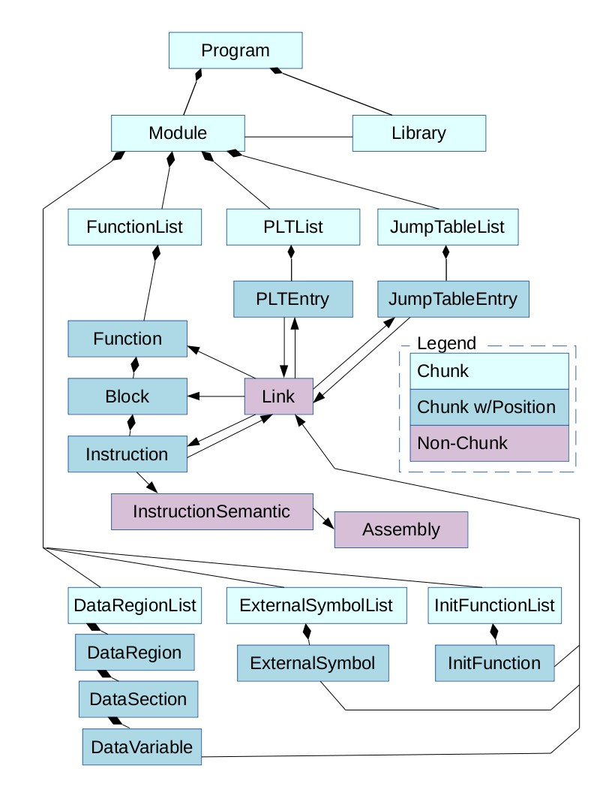

Chunk Intermediate Representation
=================================

The main data structure used in Egalito is the Chunk hierarchy, or Egalito IR.
A `Chunk <https://github.com/columbia/egalito/blob/master/src/chunk/chunk.h>`_ is a node in the graph that represents an executable.
Actually, the graph is more of a tree: every Chunk has a parent and children (typically of a homogenous fixed type).

The main property of Chunks is that they are `layout-agnostic`, meaning they can be assigned to new addresses easily.
Chunks refer to each other with Links instead of by addresses.
Chunks that have a Position often store it relative to other Chunks, and regardless of changes, an address reassignment pass can produce a valid layout.

Chunk Class Diagram
-------------------

Here is a diagram of the main classes that implement the Chunk interface:

Solid diamonds represent class composition.
Download this image as `JPG <_images/chunk1.jpg>`_, `SVG <_images/chunk1.svg>`_, or `PDF <_images/chunk1.pdf>`_.

A Module represents an executable or ELF file, parsed into memory; Library represents an ELF file that has not been parsed.
(ElfSpace is the low-level ELF representation.) Functions, (Basic) Blocks, and Instructions are the main objects.
Global variables are represented in DataVariable. References to symbols that may not have been parsed (in a different Library) are ExternalSymbols.

An in-memory Chunk hierarchy can be turned back into an executable though Egalito's code generation mechanism.
There is also partial support for a binary "archive" serialization file format.

Important Non-Chunk Types
-------------------------

`Link <https://github.com/columbia/egalito/blob/master/src/chunk/link.h>`_ forms its own inheritance hierarchy.
There are many types of Links from NormalLink to PLTLink to UnresolvedLink.

Every Instruction has an `InstructionSemantic <https://github.com/columbia/egalito/blob/master/src/instr/semantic.h>`_, which is the base class for various types of instruction details.
These classes are for the most part platform-independent (e.g. LinkedInstruction, IsolatedInstruction), but
by necessity some are platform-specific.

Assembly is an abstraction of the disassembly library output; it can
often be discarded and reconstructed, and hence uses `std::shared_ptr` (unlike most of the Chunk hierarchy).

Writing Code with Chunks
------------------------

Program is the root object type, and Module has various list classes as its children (and provides getters for each).
However, nearly all other classes have homogenous children types.
It is always possible to iterate over children in generic fashion, but the preferred style is to leverage the known children types::

    void iterateOverChildren(Function *f) {
        for(Block *b = CIter::children(f)) {  // more commonly written with auto
            ChunkDumper().visit(b);
        }
    }

This is made possible through the use of covariant return types and templates, and our many decorators.
We make heavy use of the Decorator design pattern to statically include only the necessary code and data within Chunk objects.

When it becomes necessary to handle many types of Chunks, most Egalito code is written with a Visitor design pattern.
An Egalito pass is just a Chunk visitor, with default implementations that visit all children.
In other words, code tends to look more like this::

    class SamplePass : public ChunkVisitor {
    public:
        virtual void visit(Function *function) {
            LOG(0, "Visiting function [" << function->getName() << "]");
            recurse(function);
        }

        // Not needed -- this is provided by default
        //virtual void visit(Block *block) { recurse(block); }

        virtual void visit(Instruction *instruction) {
            ChunkDumper().visit(instruction);
        }
    }

For a more complete example, start with `src/pass/stackxor.cpp <https://github.com/columbia/egalito/blob/master/src/pass/stackxor.cpp>`_.
